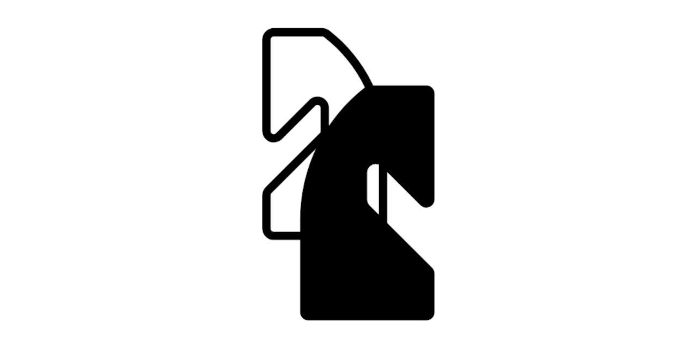

Dexter
====

====

A Chess Engine written in C++

Build instructions
--
Build project : 
    ```
    make -j8
    ```

Rebuild entire project :
    ```
    make rebuild
    ```

Build and Run :
    ```
    make run
    ```

Make Doxygen documentation :
    ```
    make docs
    ```

Clean all object files and executables :
    ```
    make clean
    ```

Documentation
--
Here is a [link to the Doxygen documentation](https://regalmoix.github.io/dexter/html/index.html)
